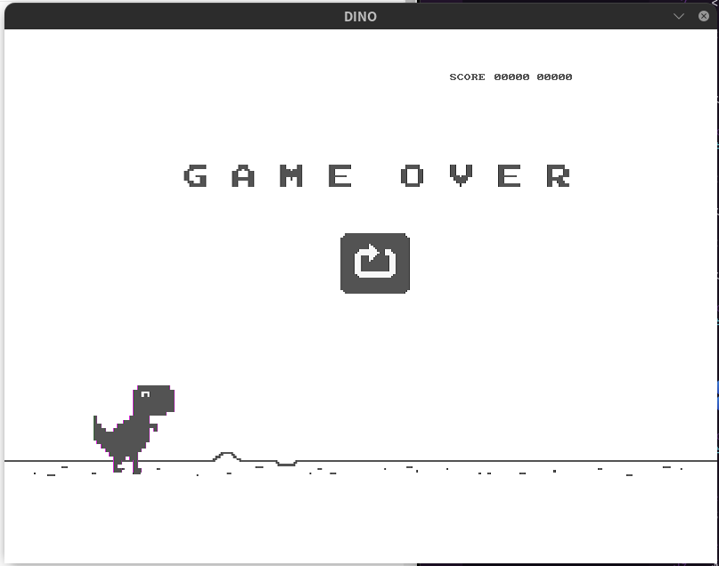

<h1 align="center">
  <br>
  <br>
  T-Rex Game
</h1>

<p align="center">By: <a href="http://github.com/emanuelv15">Emanuel Vitor Souza</a> and <a href="https://github.com/PierreBoeno">Pierre Boeno</a></p>

<p align="center">
  <a href="https://opensource.org/licenses/MIT">
    
  </a>
</p>

## 📜 Features

<ul>
  <li><p>Game developed for a work in a college subject based on Google's T-Rex.</p></li>
</ul>

<div align="center">
  
</div>

## 🧰 Techs

[//]: # "Add the features of your project here:"

🔷 **C;**
🔷 **Allegro;**

## 💻 Getting started

```bash
# Clone this repository
$ git clone https://github.com/emanuelv15/t-rex-game

# Enter the folder
$ cd t-rex-game

# Generating the executable
$ gcc dino.c -o dino $(pkg-config allegro --libs --cflags)

# To start the project
$ ./dino

```

## 🤓 How to contribute

<ul>
  <li>Fork this repository;</li>
  <li>Create a branch with your feature: <code>git checkout -b my-feature</code>;</li>
  <li>Commit your changes: <code>git commit -m 'feat: My new feature'</code>;</li>
  <li>Push to your branch: <code>git push origin my-feature</code>.</li>
</ul>

<p>After the merge of your pull request is done, you can delete your branch.</p>

## ✍️ License

This project is licensed under the MIT License - see the [LICENSE](https://opensource.org/licenses/MIT) page for details.

<a href="http://github.com/emanuelv15">Emanuel Vitor Souza</a>
